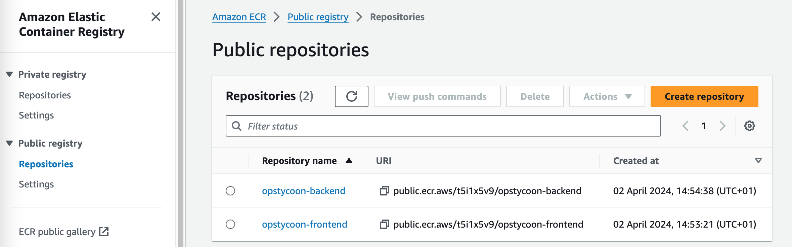
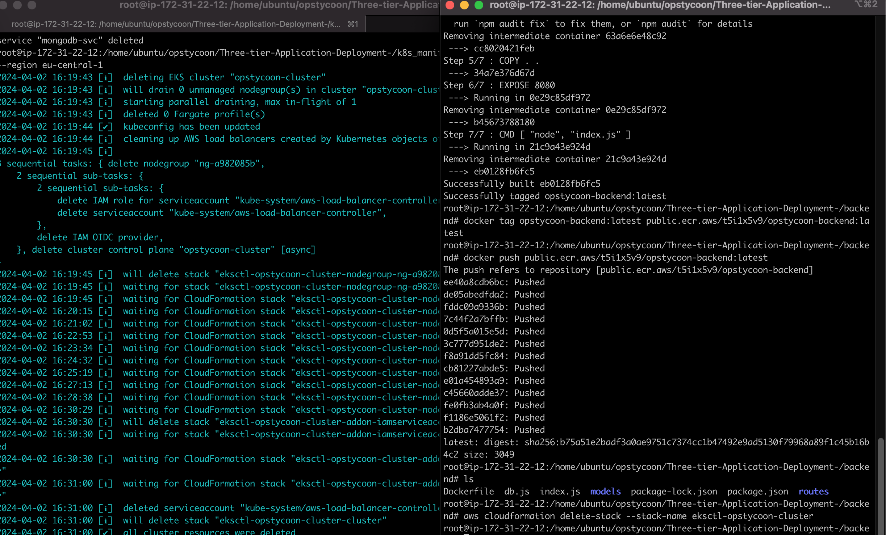
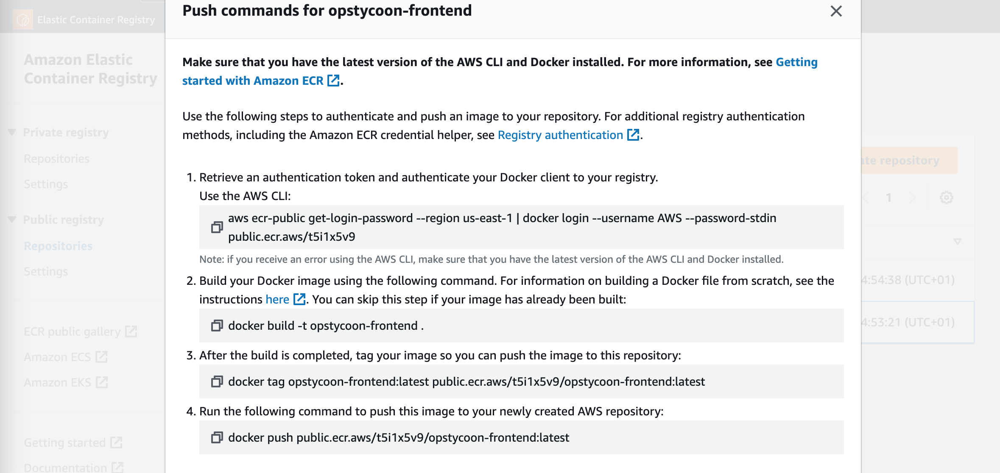
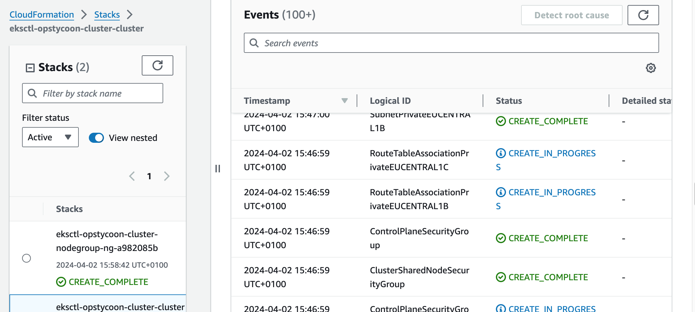
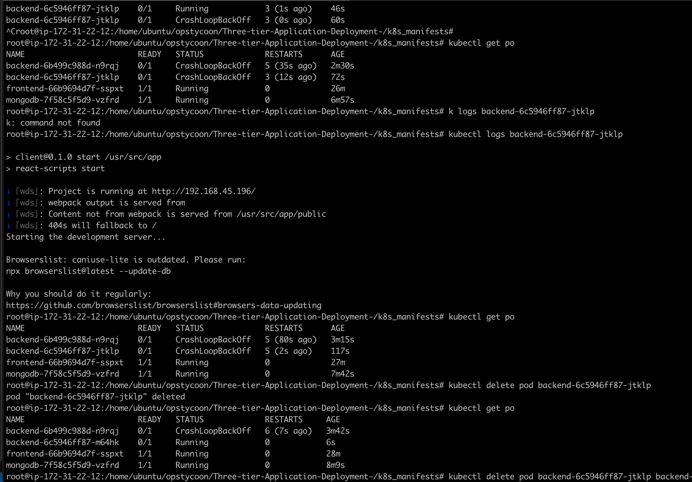
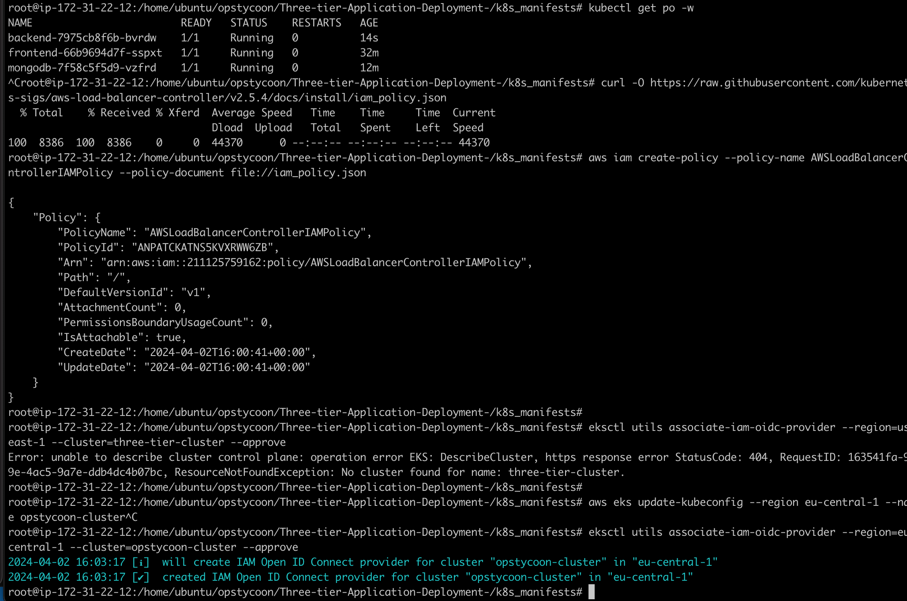
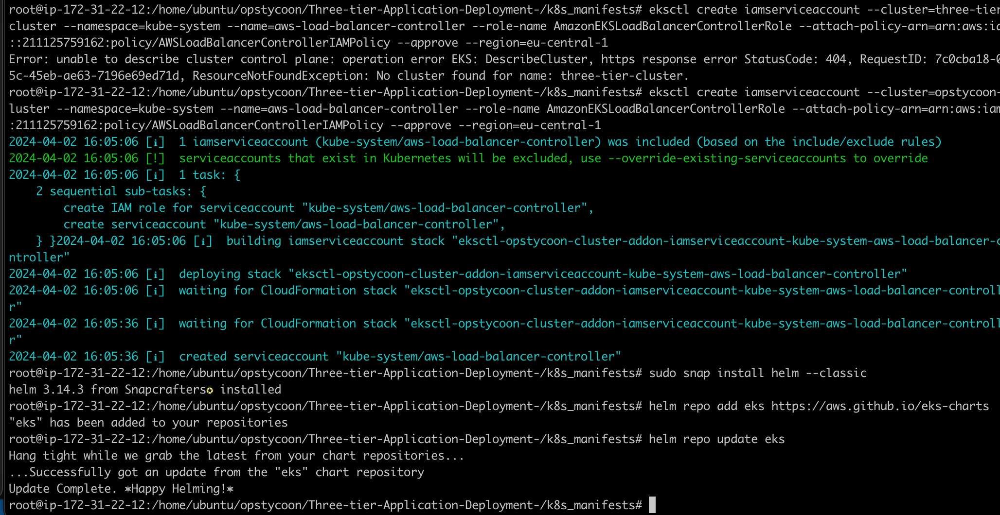
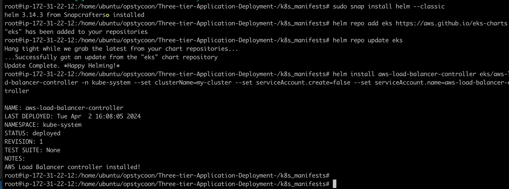
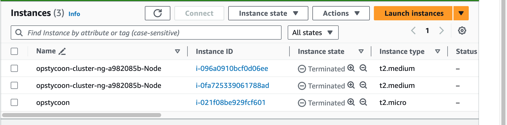
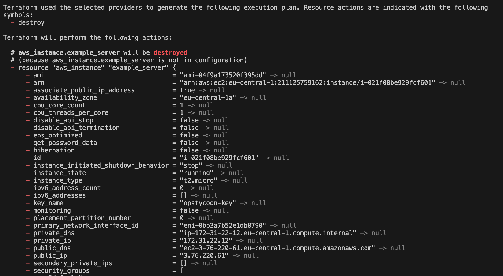

#### Deploying a opstycoon application on Kubernetes involves organizing your system into three distinct layers for optimal functionality and management.
  

Check NOTE.txt for details
  
###### Pre-requisites
  
Knowledge On Basic understanding on how these cloud tools and services works
Terraform
SSH
Amazon EC2
IAM (Identity and Access Management)
Amazon ECR (Elastic Container Registry)
Kubernetes Cluster
Helm
  
#### Step 1. Create an IAM user
  

  
click on user →create user, Give a name to your user and tick on provide user access to management console and then click on I want an IAM user option
  
choose a password for your user →click next, Attach the policies directly to your iam user → click next
  

  
note →I will provide the administrator access for now but we careful while attaching the policies at your workspace
  

  
review and create user, click on create user, download your password file if it is autogenerated otherwise it is your’s choice
  

  
Now click on your IAM user →security credentials, scroll down to access keys and create an access keys
choose aws cli from the options listed
click next and download you csv file for username and password, I choose to copy this in a notepad instead, DON'T Copy this in your readme (Your account could be banned or restricted) if publicly exposed unknowningly
  
#### open your aws console and navigate to ec2 and click on launch ec2
  
give it a name you want, I choose opstycoon,
  
I created a terraform to spine up the the ec2 instance instantly, fast and manage it easily, and easily destroy it after use.
  
If you choose to create take the same approach which i recommended to make use of IaC (Infrastructure-as-Code)
  
I created a main.tf
  

  
After this I configure my aws,
  
#### aws configure
  
(This will prompt you to insert the access key and the secret key you saved during the IAM creation)
enter your region and the format is json
  
---
  
Or You can use theAWS console if you choose
  
---
  
#### Connect to your instance and run the following commands
  
I SSH into my instance from terminal instead of using the console
  
`(ssh -i "my-key.pem" ubuntu@public-ip-here)`
  
Lets run
(sudo su - will allow you to work as a super-user;root-user), then update and create the folder
  
```
$ sudo su
$ apt update
$ mkdir opstycoon
$ cd opstycoon
```
  
#### fetch the code from github by git clone
  
```
git clone https://github.com/olawaleoyg/opstycoon.git
```
  
Cc to the folder
  
Run
USER # Replace with your username e.g ‘ubuntu’
newgrp docker
sudo chmod 777 /var/run/docker.sock
which docker
```
  
#### → Let install kubectl
  
This is a command-line tool used in managing and interacting with Kubernetes clusters
  
```
To install kubectl run the following commands
snap install kubectl --classic
```
  
#### → Install eksctl
  
It is a command-line tool used for managing Amazon EKS (Elastic Kubernetes Service) clusters.
To install eksctl tool run the following commands
  
```
curl --silent --location "https://github.com/weaveworks/eksctl/releases/latest/download/eksctl_$(uname -s)_amd64.tar.gz" | tar xz -C /tmp
sudo mv /tmp/eksctl /usr/local/bin
eksctl version
```
  
#### → Phase 2 →Built frontend and backend images
  
You can create this from the console or addthe code to your terraform, make sure its public registry.
  
#### → setup Elastic container registery (ECR)
  
It is similiar to dockerhub where we stored the docker images
  
Go to your aws console and search for ECR
click on create repository for frontend and select the public option
  

  
it will look like the image
  
#### → Setup frontend
  
In terminal go to (cd) to frontend directory and run ls command
  
#### → Go to your ecr repo and click on view push commands
  
This will give you command to log in, build, tag and push
  
You could check the Dockerfile to see the setup of what we are building.
  
#### → Run the above command one by one to build the frontend image and push to ecr repository
  
NB: my image name could be different from yours, also the region I used for mine is eu-central-1

  
```
aws ecr-public get-login-password --region eu-central-1 | docker login --username AWS --password-stdin public.ecr.aws/l0l7e4u1
docker build -t opstycoon-frontend .
docker tag opstycoon-frontend:latest public.ecr.aws/l0l7e4u1/opstycoon-frontend:latest
docker push public.ecr.aws/l0l7e4u1/opstycoon-frontend:latest
```
  
#### → Once the image is pushed, goto your ECR on the the console to verify
  

  
Welldone! We almost done.
  
Let’s run a container from the image
  
docker images -->copy the image name from the list
  
```
docker run -d -p 3000:3000 Opstycoon-frontend:latest
```
  
your frontend has setup and your application is now running to see your application you could browse →public-ip:3000
  
If your app is not showing
(Make sure you open a security group 3000 in your inbound rules)
  
Now do the same for backend! Try this and come back for the solution.
  
Let's do it together,
  
#### → Setup backend
  
Now go to backend directory to setup backend
  
Go to your ecr repository and click on view push commands of backend repository
  
run the above command one by one in your terminal
- Login, Build, tag and push like you did in frontend
  
```aws
docker build -t opstycoon-frontend .
docker tag opstycoon-backend:latest public.ecr.aws/l0l7e4u1/opstycoon-backend:latest
docker push public.ecr.aws/l0l7e4u1/opstycoon-backend:latest
```
  
Now your backend image is built successfully and also pushed to Elastic container registry which we used when we create elastic kubernetes service
  
#### → Phase 3 Kubernetes
  
##### → What is Deployment?
  
Imagine a Factory: Think of a deployment as a factory that produces and manages copies of your software applications.
Multiple Replicas: Just like a factory can produce multiple identical items, a deployment in Kubernetes can create and handle multiple copies (replicas) of your application.
Easy Updates: If you want to change or update your application, the deployment system can smoothly handle that, like swapping out parts in a factory without stopping production.
  
##### → What is Service?
  
Imagine a Reception Desk: Picture a service in Kubernetes like a reception desk in a building.
Central Point of Contact: The service provides a central point of contact for your applications. Instead of trying to find each application directly, other parts of your system can talk to the service, and it knows how to find the right application.
Stable Address: Just as you have a consistent address for the reception desk, a service has a stable address that other parts of your system can use to communicate with your applications.
  
##### → What is Namespace?
  
It’s like a labeled section within Kubernetes where you can organize and run your applications. Each namespace is like a fenced-off area where your apps can do their thing without stepping on each other’s toes.
So, in simpler terms, a namespace in Kubernetes is a way to keep different projects or applications separate and organized, making it easier to manage them in the bustling environment of a Kubernetes cluster
  
##### → Setup EKS Cluster and create a namespace
  
Run the following command to setup EKS cluster
  
```
eksctl create cluster --name opstycoon-cluster --region eu-central-1 --node-type t2.medium --nodes-min 2 --nodes-max 2
aws eks update-kubeconfig --region eu-central-1 --name opstycoon-cluster
kubectl get nodes
```
  
It takes 15 to 20 mins to create a cluster
  
on aws console search for aws cloud formation to view the events happening in creation of EKS cluster
  

  
##### → creating Namesapce from the following command
  
```
kubectl create namespace workshop
kubectl config set-context --current --namespace workshop
```
  
##### → create a deployment and service for Frontend
  
go to k8s_manifests directory there you will find deployment and service files for frontend
  
- You have to edit the file called frontend-deployment.yaml
  
- one thing you need to be changed that is your image name (You can see it in the ECR repository)
  
So, go to your ecr repository → select the frontend repository → click on view public listing and copy the image name and paste inside the frontend-deployment.yaml file
  
Now run the following commands to create the deployment and service for frontend
  
```
kubectl apply -f frontend-deployment.yaml
kubectl apply -f frontend-service.yaml
```
  
##### → Create a deployment and service for Backend
  
In the same folder you will find backend-deployment.yaml and backend-service.yaml
you have to edit the file called backend-deployment.yaml
one thing you need to be changed that is your image name
so, go to your ecr repo → select the backend repo →click on view public listing and copy the image name and paste inside the backend-deployment.yaml file
Now run the following commands to create the deployment and service backend
  
```
kubectl apply -f backend-deployment.yaml
kubectl apply -f backend-service.yaml
kubectl get pods -n workshop
```
  
Now our two tier is ready that is frontend and backend let’s setup the third tier
  
Let assume you run in trouble where your app is not running, troubleshoot, describe the pod, check the logs, verify if its pulling the right image
  

  
##### → Setup Database tier
  
Locate the mongo folder that stores deployment, service and secrets manifests
  
Run the below commands to setup database tier
  
```
kubectl apply -f .
kubectl get all
```
  
Now your all three tiers are ready to go but how do you access them for that we have to create a application load balancer to route outside traffic towards cluster and an ingress for in internal routing between our 3 tiers
  
##### → Setup Application Load balancer and ingress
  
we have to create a application load balancer to route outside traffic towards cluster and an ingress for in internal routing between our 3 tiers
  
##### → Setup aws load balancer ; installation and attachment it to your EKS cluster
  
- Below command fetch the iam policy for your ALB
  
```
curl -O https://raw.githubusercontent.com/kubernetes-sigs/aws-load-balancer-controller/v2.5.4/docs/install/iam_policy.json
```
  
This command create the iam policy in your aws account from iam_policy.json file that is setup in the first command
  
```
aws iam create-policy --policy-name AWSLoadBalancerControllerIAMPolicy --policy-document file://iam_policy.json
```
  

  
This command apply the load balancer policy to your eks cluster so that your eks cluster is working with your load balancer according to the policy
  
```
eksctl utils associate-iam-oidc-provider --region=eu-central-1--cluster=opstycoon-cluster --approve
```
  
This command create and attach an service account to your cluster so that your cluster is allowed to work with load balancer service
  
please change your aws account number. from the below command otherwise it won’t work
  
```
eksctl create iamserviceaccount --cluster=opstycoon-cluster --namespace=kube-system --name=aws-load-balancer-controller --role-name AmazonEKSLoadBalancerControllerRole --attach-policy-arn=arn:aws:iam::123496666747:policy/AWSLoadBalancerControllerIAMPolicy --approve --region=eu-central-1
```

  
All the policies are attached let’s deploy the load balancer
  
- For this we have to install helm→Helm is a special tool that helps you easily carry and manage your software when you’re using Kubernetes, which is like a big playground for running applications.
  
```
sudo snap install helm --classic
```
  

  
After this we have to add a particular manifest for load balancer that is pre written by someone on eks repo by using helm
  
```
helm repo add eks https://aws.github.io/eks-charts
```
  
- update the eks repo using helm
  
```
helm repo update eks
```
  
Install the load balancer controller on your eks cluster
  
```
helm install aws-load-balancer-controller eks/aws-load-balancer-controller -n kube-system --set clusterName=opstycoon-cluster --set serviceAccount.create=false --set serviceAccount.name=aws-load-balancer-controller
kubectl get deployment -n kube-system aws-load-balancer-controller
```
  

  
Now your Load balancer is working let’s setup Ingress for internal routing
  
- Look for the full_stack_lb.yaml file
  
```
kubectl apply -f full_stack_lb.yaml
kubectl get ing -n workshop
```
  
Go to your Web Browser and paste the above dns address, wait some while
  

  
Your application is accessible through load balancer ingress
  
If it doesn't copy your public Ip:3000 to se if you can access it, if that worked, then the DNS in your ingress should work.
  
Congratulations!
  
##### → Destroy Everything
  
- On your current folder run
  
On your current folder run
  
```
kubectl delete -f .
```
  
- go to mongo folder to delete database tier
  
```
kubectl delete -f .
```
  
- Delete the cluster and the stack of your cloud formation
  
```
eksctl delete cluster --name three-tier-cluster --region us-east-1
aws cloudformation delete-stack --stack-name eksctl-three-tier-cluster-cluster
```
  
- you could checkout all the changes in cloud formation console of aws
  

  
Everything is deleted now thanks me for reducing your aws bill
well our project is completed here if you comes at this point do clap, well done.
  
For me I just delete all these with a command by using terraform,

  
Don't forget to delete when you are done, else you will be charged for the resources.
  
Thank you.
- Opstycoon
  